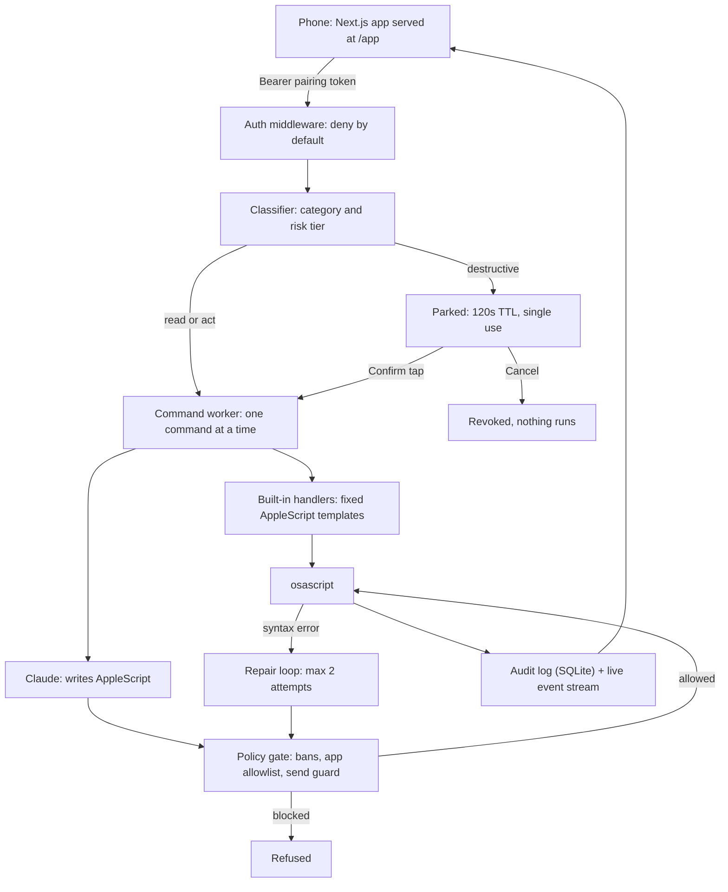

# Imperium

Text your Mac from your phone and it does the thing: open apps and sites, play
music, send a message or an email, run git, scaffold a project. A FastAPI agent
runs on the Mac, turns plain English into AppleScript (with Claude when the
command is not one of the built-in ones), and executes it — behind
authentication, a permission model, a script policy gate, and an audit log.

**Demo (v1, the original hackathon build):** https://youtu.be/jEpbP-iGQTk



## What it can do

| Command | Runs through | Needs an API key |
|---|---|---|
| "play lofi beats on Spotify", pause, skip, shuffle, playlists | Built-in handler | No |
| "text John saying I'm on my way" (by contact name or number) | Built-in handler, **Confirm required** | No |
| "commit in imperium with message fixed the gate", push, pull, status | Built-in handler (**push needs Confirm**) | No |
| "email john@example.com saying see you at 5" (short body, typed on screen) | Built-in handler, **Confirm required** | No |
| "close everything" | Built-in handler, **Confirm required** | No |
| "open Notes", "open github", "search YouTube for …", multi-step commands | Claude writes AppleScript, policy gate checks it | Yes |
| "create a calculator app" | Claude | Yes |

## The phone app

A Next.js + TypeScript static export, served by the backend at `/app` on the
same origin as the API — so no CORS is ever opened and the pairing token never
leaves the phone.

| Screen | What it shows |
|---|---|
| **Command** | Command bar, per-command live progress (classified → model call → script → result), and confirm cards showing exactly what a destructive command will do, with a countdown and Cancel |
| **Activity** | The live event stream from the Mac, grouped by command |
| **Audit** | Every command, decision, and the exact AppleScript that ran, filterable and paged |
| **Stats** | Success rate, p50/p95 latency, token usage, repairs, blocked scripts |
| **Settings** | Server and stream status, unpair |

## Security

An agent that executes real actions on a Mac is a remote-execution surface, so
security is the core feature, not an add-on:

- **Pairing-token auth** on every endpoint (QR-code pairing, deny-by-default middleware)
- **Tiered permissions** — destructive actions (send email/text, git push, quit everything) park until you tap Confirm on the phone; Cancel revokes the parked command for good
- **Script policy gate** — model-written AppleScript is never executed raw: a lexer that mirrors AppleScript blocks shell escapes, credential access, file deletion, unconfirmed sends, and apps outside the allowlist; built-in handlers quote every value taken from a command
- **Serialized execution** — commands run one at a time on a worker thread, off the event loop, so the server stays responsive
- **Hardened frontend hosting** — each exported page is served with a Content-Security-Policy whose `script-src` lists the sha256 hash of that page's inline scripts (never `unsafe-inline`), plus `frame-ancestors 'none'` and friends
- **Append-only audit log** of every command, decision, result, and executed script (`~/.imperium/audit.db`)

The full threat model is in [SECURITY.md](SECURITY.md).

## Setup

Requirements: macOS, Python 3.9+, Node 22+.

```bash
pip install -r backend/requirements.txt
cd frontend && npm ci && npm run build && cd ..   # builds the phone app into frontend/out
python3 backend/main.py
```

Then scan the QR code printed in the terminal to pair your phone (it opens
`http://YOUR_MAC_IP:8000/app` with a one-time pairing link). Without the build
step, `/app` serves a page telling you to run it.

General commands ("open Notes", "search YouTube for …") call Claude, so put an
Anthropic API key in `backend/.env` as `ANTHROPIC_API_KEY=…`. Everything in the
table above marked "No" works without one.

For access away from home Wi-Fi, run the server behind
[Tailscale](https://tailscale.com) and pair using the Tailscale IP — never
port-forward the server to the public internet.

## Working on this project

```
backend/      FastAPI app. main.py is the entry point: routes, classifier,
              handlers, repair loop. security.py (auth), permissions.py (tiers,
              parked confirmations), policy_gate.py (script checks),
              audit.py (SQLite log), tracing.py, events.py (live stream),
              frontend_host.py (serves frontend/out with the CSP)
frontend/     Next.js 16 + React 19 + Tailwind v4, static export to frontend/out
evals/        tasks.yaml (the checks), runner.py (harness + mutations),
              check_frontend_export.py, RESULTS.md (generated)
```

```bash
python3 evals/runner.py              # offline suite + mutation check, writes evals/RESULTS.md
python3 evals/runner.py --no-write   # same, without writing the report
python3 evals/runner.py --live       # end-to-end tasks on a real Mac (needs an API key)
python3 evals/check_frontend_export.py   # serves the built export and checks headers and CSP hashes

cd frontend && npm run dev           # Next dev server, proxies the API to :8000
cd frontend && npm run lint && npm run typecheck && npm test && npm run build
```

House rules for changes:

- The offline suite stays at 100%, and every mutation stays caught. A new safety property needs both a task in `tasks.yaml` and a mutation that breaks it.
- Model-written AppleScript goes through the policy gate; values interpolated into handler templates go through `policy_gate.applescript_literal`.
- The frontend uses no `dangerouslySetInnerHTML`, no inline scripts of its own, and makes no third-party requests — the CSP depends on it.
- Never commit `backend/.env`, `~/.imperium`, or anything generated (`frontend/out`, `node_modules`).

## Evals

`evals/` holds the harness: [`tasks.yaml`](evals/tasks.yaml) defines the checks,
[`runner.py`](evals/runner.py) runs them, and [`RESULTS.md`](evals/RESULTS.md) is
regenerated on every run.

- **Offline suite** — deterministic checks of auth, the permission gate and confirm flow, the policy gate, handler escaping, the validator, the repair loop, tracing, the audit store, the event stream, and the frontend hosting headers. No API key; process spawns, keystrokes, and model calls are intercepted (including at import), so it never drives the Mac.
- **Mutation check** — deliberately breaks each safety property in turn and fails unless the suite catches it.
- **Export check** — serves the built frontend through the backend in-process and verifies every page's security headers and CSP script hashes.
- **Live suite** — real commands on a real Mac, verified by querying macOS state. Anything that would send, push, delete, or quit is refused even if listed. **Not yet run.**

GitHub Actions runs the offline suite, the mutation check, the frontend lint,
typecheck, tests, build, and the export check on every push.

## Project status

- **Done** — v2 security layer (auth, tiers, policy gate, audit); v3 backend (live event stream, cancel, audit paging, stats, serialized worker, CSP-hardened hosting) and the Next.js phone app; evals and CI.
- **In progress** — an adversarial review pass over the v3 code, and widening the frontend unit tests.
- **Open** — the live eval suite has never run (needs an `ANTHROPIC_API_KEY` on the Mac); Tailscale setup; a new demo video and screenshots.

## Team

Originally built as a team hackathon project (March 2026) by:

- **Jasman Sidhu** ([@Jasmanss](https://github.com/Jasmanss)) — lead developer
- **Mark Gjonlleshaj** ([@MarkGjo](https://github.com/MarkGjo))
- **Meron M** ([@MeronM18](https://github.com/MeronM18))

This repository is the actively maintained home of the project; the full commit
history from the hackathon is preserved.

### What I built (Jasman)

- The pivot from voice control to the text-command architecture
- Spotify control, Git integration, and contact-based iMessage sending
- Visual character-by-character typing (pyautogui) and the live navigation status bar
- Project generation, command parsing improvements, and documentation
- v2 and v3: the security layer, the eval harness, and the phone app rebuild

## The Future

- **Typed action registry** — replace free-form AppleScript with a fixed set of typed actions, and expose it as an MCP server
- **Automation chains** — workflows that execute multiple commands in sequence
- **Voice control** — speech-to-text so you can speak commands instead of typing
- **Multi-device support** — control multiple Macs from a single interface
- **Screen awareness** — let the agent see the screen and make context-aware decisions

---

Built with Claude, FastAPI, AppleScript, and Next.js.
